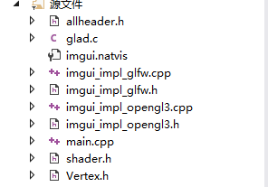
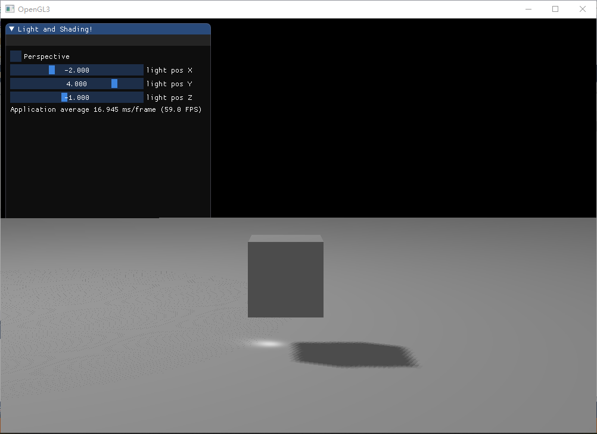
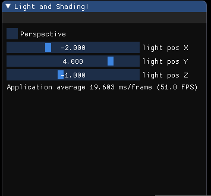
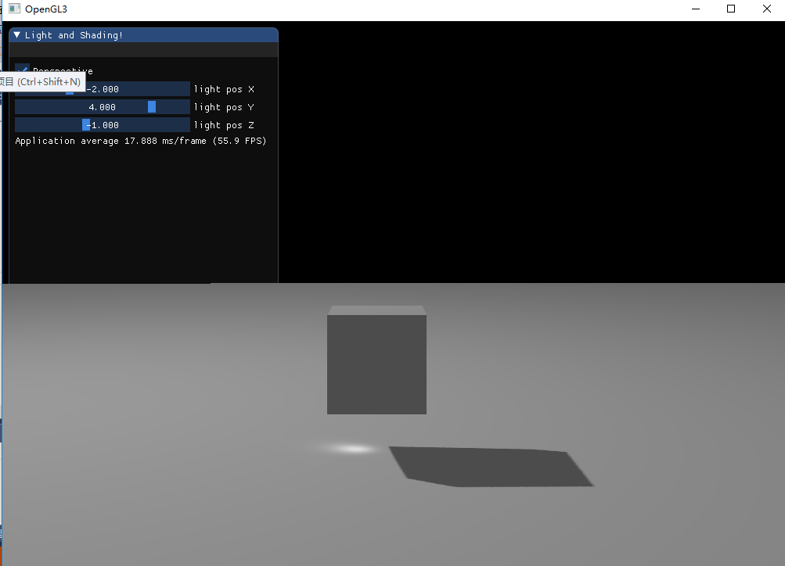
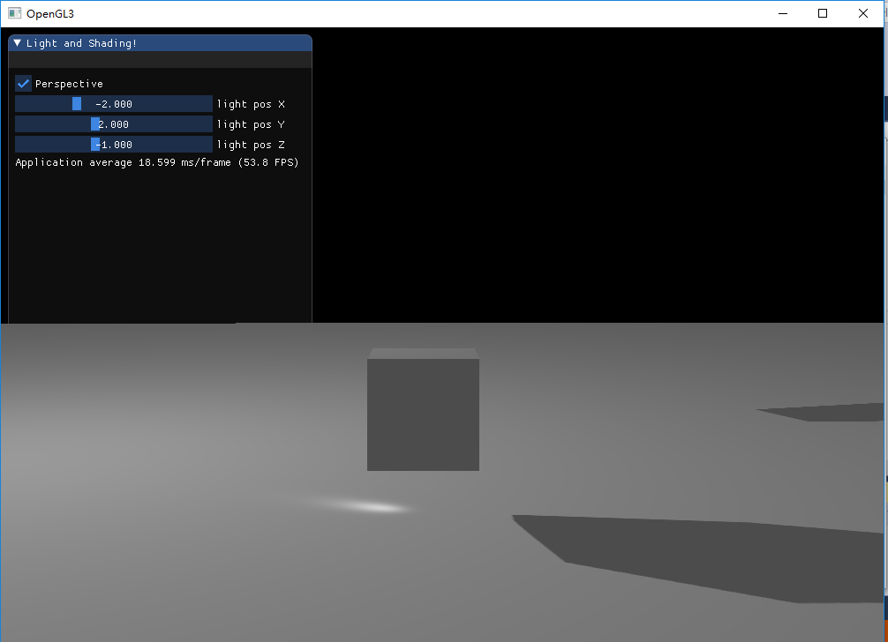
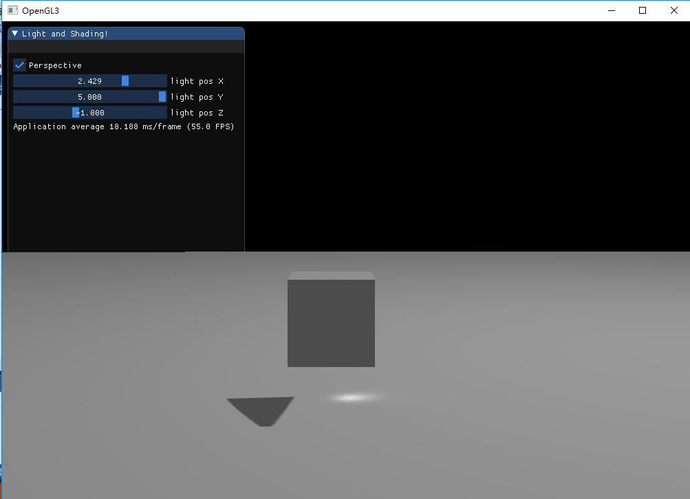

# Homework6
---
## 实验环境
**Windows 10** 

**Visual Studio **

**OpenGL4.3+GLFW+ImGui+GLM**

---

## 实验代码文件分布




关键源代码文件有：**allheader.h:引入相应的头文件、库、命名空间的使用**，**shader.h：负责着色器程序的创建、编译、使用、uniform变量的设定**，**main.cpp：主逻辑的实现**。同时还有文件：

+ **shadow_getDepth_VS.txt: 用于将世界坐标变为以光源视角的坐标**

+ **shadow_getDepth_FS.txt: 该片段着色器实际上并没有做任何的，只是一个形式，便于shader类生成着色器程序**
+ **shadow_applyDepth_VS.txt: 利用光源坐标系矩阵生成物体相应的坐标，利用一般的矩阵生成物体在摄像机坐标系中的坐标**
+ **shadow_apply_FS.txt: 利用物体在光源坐标系中的z值与第一步获得的深度图比较，判断一个点是否在阴影下并决定其颜色**

---

## 作业要求

##### 1. 实现方向光源的Shadowing Mapping: 要求场景中至少有一个object和一块平面(用于显示shadow) 光源的投影方式任选其一即可 ，在报告里结合代码，解释Shadowing Mapping算法 

利用正交投影生成的光空间获得的深度图之后渲染得出效果图如下：



场景中有两个物体白色的平面、白色的物体，以及一个虚拟白色光源，选择白色的原因在于个人觉得白色背景系下的阴影效果较好。光照模型采用的是冯氏光照模型。阴影算法sahdow mapping。

**shadow mapping**：

shadow mapping关键在获取在光源视角下scene的深度图，这个深度图存储了在光源视角下一scene中距离光源最近的点的深度信息。而该深度信息的在opengl的渲染过程中是自动写入z-buffer缓冲中的。之后再在后期的渲染过程中将一个物体每个点的深度与该深度图中对应的位置的深度信息对比，并以此来判断其一个点是否在阴影中。因此总结在opengl中时下shadow mapping算法的两个大的步骤为：（1）获取深度图.（2）利用深度图来判断一个点是否位于阴影中。

***获取深度图***：

利用opengl的渲染过程来生成在光源视角下的深度信息，并存到指定的缓冲中。指定的缓冲采用帧缓冲，并声明相应的大小的纹理来作为帧缓冲的帧缓冲的附件，并调用glTexImage2D函数设置纹理的数据类型为深度信息，纹理的大小。以下是相应过程：

```c++
//创建帧缓冲对象
	GLuint depthMapFBO;
	glGenFramebuffers(1, &depthMapFBO);
	//创建对应的纹理对对象作为帧缓冲的附件
	GLuint depthMap;
	glGenTextures(1, &depthMap);
	glBindTexture(GL_TEXTURE_2D, depthMap);

	//设置纹理的相关参数：纹理映射、环绕方式、数据等
	glTexImage2D(GL_TEXTURE_2D, 0, GL_DEPTH_COMPONENT, MAXWIDTH, MAXHEIGHT, 0, GL_DEPTH_COMPONENT, GL_FLOAT, NULL);
	glTexParameteri(GL_TEXTURE_2D, GL_TEXTURE_MIN_FILTER, GL_NEAREST);
	glTexParameteri(GL_TEXTURE_2D, GL_TEXTURE_MAG_FILTER, GL_NEAREST);
	glTexParameteri(GL_TEXTURE_2D, GL_TEXTURE_WRAP_S, GL_REPEAT);
	glTexParameteri(GL_TEXTURE_2D, GL_TEXTURE_WRAP_T, GL_REPEAT);

	//将纹理对象添加到帧缓冲中
	glBindFramebuffer(GL_FRAMEBUFFER, depthMapFBO);
	glFramebufferTexture2D(GL_FRAMEBUFFER, GL_DEPTH_ATTACHMENT, GL_TEXTURE_2D, depthMap, 0);
	glDrawBuffer(GL_NONE);
	glReadBuffer(GL_NONE);
	glBindFramebuffer(GL_FRAMEBUFFER, 0);
```

在设置好相应的缓冲后，模拟一个渲染过程，利用这个渲染过程生成相应的深度值，并将这些深度值写入到我们申请的深度缓冲中。默认的渲染过程是将深度信息写入到opengl自动创建的缓冲中，所以我们需要告诉程序将深度信息写入到我们指定的缓冲中，这个调用函数

> glBindFramebuffer(GL_FRAMEBUFFER, depthMapFBO);
>
> 其中的参数后者即为目标缓冲的ID，若将其设为0，则为将渲染过程中深度缓冲绑定回默认的深度缓冲。绑定后只要进行正常的渲染过程即可：生成将世界空间转变为光源视角的观察矩阵矩阵、各个对象的模型矩阵，并将他们传入到顶点着色器中，至于片段着色，我们的目的在于获取深度值，不太关心颜色值，所以片段着色器可以什么都不用做。
>
> ```c++
> //生成光源空间矩阵、物体变换模型矩阵
> glm::mat4 lightProjection, lightView;
> 		glm::mat4 lightSpaceMatrix;
> 		if (perspective) lightProjection = glm::perspective(glm::radians(45.0f), (float)MAXWIDTH / (float)MAXHEIGHT, 0.1f, 7.5f);
> 		else lightProjection = glm::ortho(-10.0f, 10.0f, -10.0f, 10.0f, 1.0f, 7.5f);
> 		lightView = glm::lookAt(lightPos=glm::vec3(x,y,z), glm::vec3(0.0f), glm::vec3(0.0, 1.0, 0.0));
> 		lightSpaceMatrix = lightProjection * lightView;
> 		glm::mat4 model = glm::mat4(1.0f);
> 		//设定视口大小与纹理大小一致
> 		glViewport(0, 0, MAXWIDTH, MAXHEIGHT);
> 		//绑定我们设定的缓冲为渲染过程中深度信息写入的过程，之后写入部分由opengl去完成
> 		glBindFramebuffer(GL_FRAMEBUFFER, depthMapFBO);
> 		glClear(GL_DEPTH_BUFFER_BIT);
> 		//渲染平面
> 		getDepthShader.use();
> 		getDepthShader.setVertexUniformView(lightSpaceMatrix, "lightSpaceMatrix");
> 		getDepthShader.setVertexUniformModel(model, "model");
> 		glBindVertexArray(planeVAO);
> 		glDrawArrays(GL_TRIANGLES, 0, 6);
> 		//渲染立方体
> 		model = glm::translate(model, glm::vec3(0.0f, 0.5f, 0.0));
> 		getDepthShader.setVertexUniformModel(model, "model");
> 		glBindVertexArray(cubeVAO);
> 		glDrawArrays(GL_TRIANGLES, 0,(GLuint)36);
> 		glBindFramebuffer(GL_FRAMEBUFFER, 0);
> ```
>
> 以上渲染过程后便可以进行下一步了。
>
> ***利用深度贴图决定点是否在阴影中***
>
> 该过程便是正常的渲染过程，但是需要注意的这个过程的模型矩阵需要第一次获得深度贴图的渲染过程的模型矩阵相同。
>
> 在决定一个点是否在阴影中时，只需要将纹理贴图以纹理的方式传入到片段着色器中即可，同时在顶点着色器中输出scene中各个对象点在进过光源空间矩阵变换后的对应点，其中位置的z值便是这些点的实际深度值，而x、y值共决定了该点应该对应深度贴图中哪个位置中存储的深度值，将两者进行比较，如前者大于后者，则该点判断为在阴影中，否则不再阴影中。

```c++
uniform sampler2D shadowMap;//传入深度贴图
float closestDepth = texture(shadowMap, projCoords.xy).r;//利用x、y获得纹理贴图中距离光源最近的深度值
float currentDepth= projCoords.z;//当前点实际的深度值
shadow = currentDepth  > closestDepth  ? 1.0 : 0.0;//若在阴影中shadow置为1，否则为0
vec3 lighting = (ambient + (1.0 - shadow) * (diffuse + specular)) * color;//shadow参与到光照颜色计算->若shadow=1，在阴影中，则该点无漫反射和镜面反射。
```


##### 2. 修改GUI 

GUI组成：



可调参数：perspective:生光源view矩阵时采用透视矩阵，否则采用正交矩阵

其余三个调节的分别是光源的x、y、z坐标。y坐标必须大于0，x、z变化范围为-5.0——5.0.

##### 3. 实现光源在正交/透视两种投影下的Shadowing Mapping 

通过上面的GUI勾选perspective，光源采用透视投影，否则为正交投影。

下图分别为在正交和透视下的效果图：

**正交**


**透视**



**分析**：

通过两幅图比较，很显然，透视投影下的shadow效果更好，其体现在两个方面。首先，透视下的整个scene亮度角号，且平面上较为平滑；再就是就shadow本身理来说，器边缘平滑，而正交边缘即使经过PCF处理后仍具有明显的边齿，不怎么平滑。在相同的参数下，透视投影下的shadow交正交下的shadow面积要大，这与实际上的理论分析是一致，毕竟在透视下的光并不是平行同方向的，具体的大小与光源位置远近有关。

##### 4.优化Shadowing Mapping 

优化方式主要是针对边缘锯齿，通过PCF平均化一个点八领域内点的深度，可以一定程度上模糊边缘锯齿。通过阴影平移缓解由于阴影贴图解析度的限制导致的阴影失真。

但是以上的优化也是有限的，通过改变光源位置，会导致一些幅效果：



透视投影下，改变光源相对于物体的高度，此时在平面上出现了多个阴影，也是由于随着光源位置的改变，光源view矩阵改变，在相同的透视投影下，更多的点采用了阴影贴图上的同一个位置的深度，信息，从而导致阴影的“复制”。



调节x，使得阴影一部分消失了，这与阴影位移有关，当阴影位移较大是，导致在判断改点是否在阴影下是被误判为不再阴影中，从而导致阴影的缺失。通过移动z值，也会产生相应的现象。所以通过阴影平移可以缓解条纹的情况，但是也会导致光源的移动时原本需要的阴影的缺失。

## 程序说明

主要的逻辑是依据shadow mapping算法的逻辑思维来的。思路在shadow mapping的解释中。

最终的效果在视屏：**result.mp4**中。

